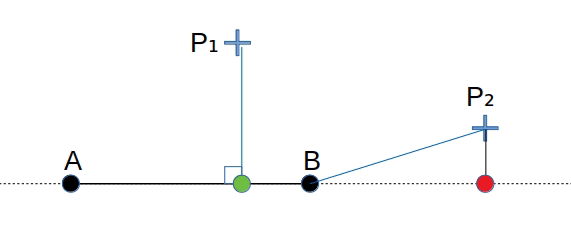

# Projet FAIN

*Nathan ROTH - M1 CMI IIRVIJ*

## Table des matières

1. [Installation](#installation)
1. [Manuel d'utilisation](#manuel-dutilisation)
  1. [Mode Insertion](#mode-insertion-i)
  1. [Mode Insertion](#mode-vertex-v)
  1. [Mode Insertion](#mode-edge-e)
  1. [Exemple](#exemple)
1. [Détails téchniques](#détails-techniques)
  1. [Représentation du polygone en mémoire](#représentation-du-polygone-en-mémoire)
  1. [Opérations mathématiques](#opérations-mathématiques)
  1. [Sélection](#sélection)
  1. [Scanline](#scanline)

## Installation

Télécharger l'archive et extraire les fichiers. A la racine, entrer :

```bash
$ make
$ ./plot <largeur> <hauteur>
```

## Manuel d'utilisation

Le programme est doté de trois modes d'opération :
- **Insertion** : construction du polygone
- **Vertex** : manipulation d'un sommet
- **Edge** : edition d'un arête

Abréviations :
- `MLB` : Mouse Left Button, Clique Gauche
- `MMB` : Mouse Middle Button, Clique du Milieu
- `MRB` : Mouse Right Button, Clique Droit

### Mode Insertion (`i`)

- `MLB` : permet à l'utilisateur d'ajouter un sommet à la suite du dernier sommet de la figure à l'emplacement de la souris.

### Mode Vertex (`v`)

- :arrow_double_up:(page précédente) : Selectionne le vertex suivant.
- :arrow_double_down:(page suivante) : Selectionne le vertex suivant.
- `s` : supprime le vertex selectioné et joint les deux sommets adjacents s'ils existent.
- `MRB` : Séléction. (Selectionne le vertex le plus proche de la souris)
- Flèches directionelles (:arrow_up: :arrow_down: :arrow_right: :arrow_left:) : Déplace le sommet selectionné d'un pixel.

### Mode Edge(`e`)

- :arrow_double_up:(page précédente) : Selectionne le vertex suivant.
- :arrow_double_down:(page suivante) : Selectionne le vertex suivant.
- `MRB` : Sélection
- `MMB` : Subdivision de l'arête en 2
- Flèches directionelles (:arrow_up: :arrow_down: :arrow_right: :arrow_left:) : Déplace l'arête selectionnée d'un pixel.

### Exemple

Pour chaque exemple, les commandes permettant de reproduire l'exemple sont listées.

**Création**
- Mode Insertion (`I`)
- Série de `MLB` aux positions souhaitées


**Remplissage scanline**
- Touche `F` dans n'importe quel mode


**Sélection**
- Mode Vertex (`V`)
- `MRB` près du sommet à sélectionner
- Mode Edge (`E`)
- `MRB` près de l'arête à sélectionner


**Modification**
- Mode Edge (`E`)
- Selectionner une arête
- Subdiviser l'arête en cliquant sur le `MMB`
- Mode Vertex (`V`)
- Déplacer le sommet à laide des flèches directionnelles


**Suppréssion**
- Mode Vertex (`V`)
- Selectionner le sommet à supprimer
- Appuyer sur `S`


## Détails techniques

### Représentation du polygone en mémoire

Pour représenter les sommets en mémoire, on se sert d'une liste chainée. Cela permet un parcours de la courbe, ainsi qu'une suppression ne requiérant pas de déplacements de données en mémoire. Il est tout de même nécessaire de parcourir les points précédant dans la liste lors d'un ajout/d'une suppréssion.

[`polygon.h`](./polygon.h)
```c
typedef struct vertex_s
{
    struct vertex_s* next; // sommet suivant
    Vec2 position;         // position du sommet
} Vertex;
```

On créé une structure `Polygon` permettant de stocker la référence du premier sommet ainsi que celle du dernier. 

[`polygon.h`](./polygon.h)
```c
typedef struct s_polygon
{
    struct s_vertex* first; // premier sommet du polygone
    struct s_vertex* last;  // dernier sommet
    enum PolyType type;     // type du polygone (OPENED/CLOSED)
    size_t size;            // taille du polygone (nombre de sommets)
} Polygon;
```
Ainsi, lors de l'ajout d'un sommet en fin de chaine (lors du dessin) il est inutile de parcourir la chaine. 
Dans le cas où le polygone est fermé, `polygone->last->next = polygone->first`. De cette manière, la fonction de dessin parcourant la chaine a pour condition de s'arreter lorsqu'elle rencontre à nouveau le premier sommet. Dans le cas ouvert, `polygone->last->next = NULL`, et le parcours s'arrete en rencontrant le `NULL`.

Les méthodes relatives à la manipulation du polygone sont déclarées dans le fichier [[`polygon.h`](./polygon.h)] et définies dans [`polygon.c`](./polygon.c).

### Opérations mathématiques

Création d'une structure représentant des vecteurs 2D.

```c
typedef struct vec2_s {
    float x, y;
} Vec2;
```
Les opération mathématiques sont déclarées dans [`vec2.h`](./vec2.h) et définies dans [`vec2.c`](./vec2.c).

### Sélection

La sélection des sommets au clique droit se fait simplement en parcourant tous les sommet en comparant à la distance minimum trouvée plus tôt. La distance calculée est la distance au carré. En effet, comme il s'agit de comparer, il est inutile de calculer la distance exacte en appellant la fonction racine carrée.

La sélection des arêtes se fait en calculant d'abord le projeté de la position du clique sur la droite représentée par le segment. Si le projeté est compris entre A et B, on calcule la distance entre le projeté et le clique (`P1`). Si le projeté est en dehors de cet intervale, on calcule la distance depuis le point le plus proche du projeté (`P2`). De la même façon que pour le sommet, la distance calculée est la distance au carré.



### Scanline

- Pour chaque rangée horizontale de pixel, on calcule les intersections entre cette rangée et les arêtes du polygone. 
- Toutes les intersections sont introduites dans un tableau, accompagnées du signe (montante/descendante) de l'arête dont l'intersecion fait partie. 
- Une fois la liste des intersection construite, on parcours cette liste de 2 en 2 pour tracer le remplissage. 
- Si les 2 intersections ont la même cordonnées x (un sommet du polygone), on examine leurs signes. S'ils sont identiques (-/- ou +/+), on ignore un des point puis on avance de 1. Sinon on avance de 2.

Cette implémentation est naïve. A chaque balayage elle calcule l'intégralité des intersections. L'implémentation de *Foley et al.* est nettement plus optimisée car elle "prédit" les intersections au balayage suivant en sauvegardant la pente des arêtes actives. Elle évite également un parcours complet de la figure à chaque passage.